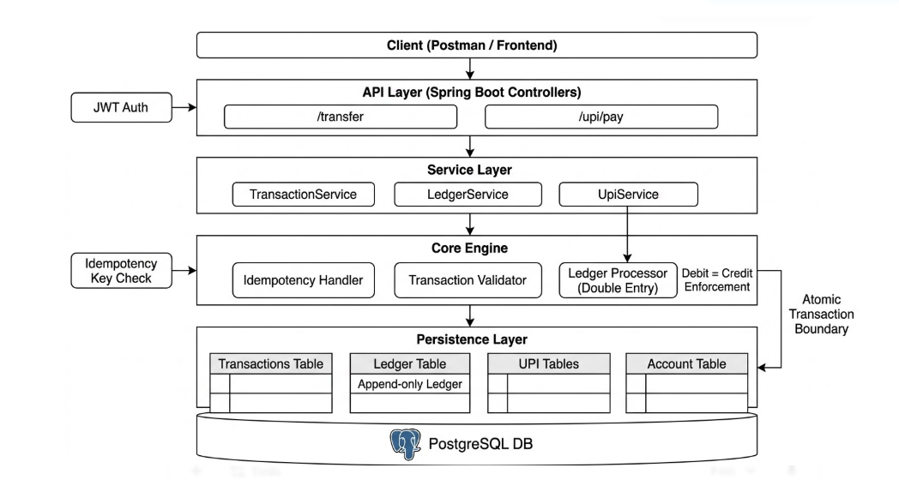
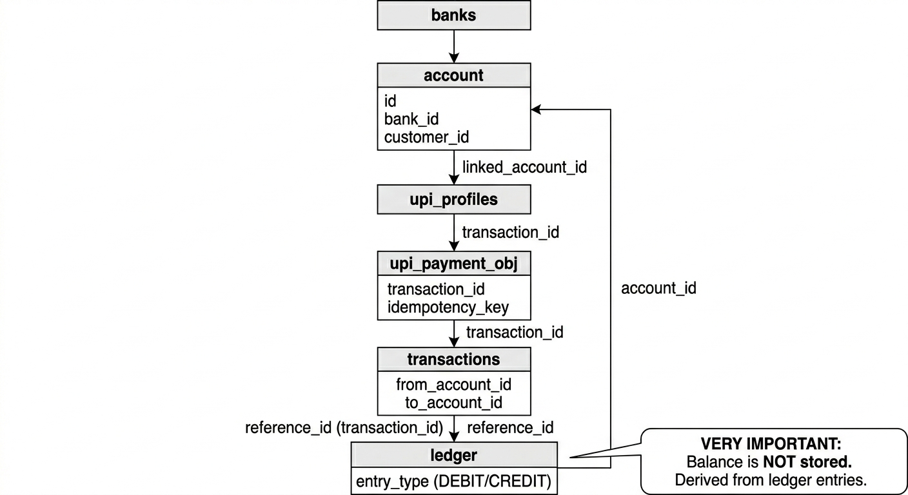
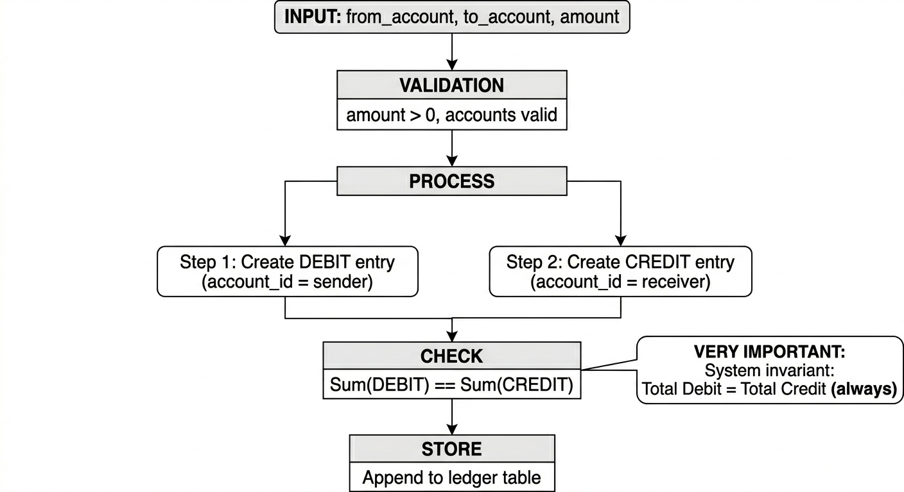
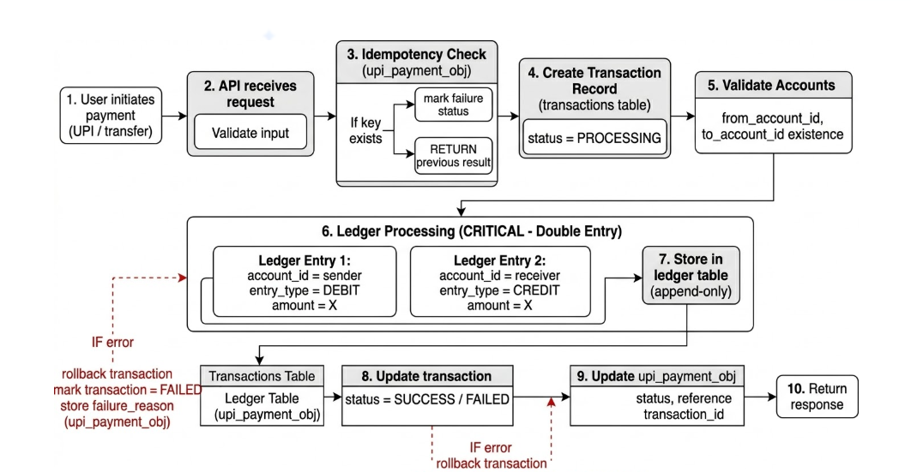
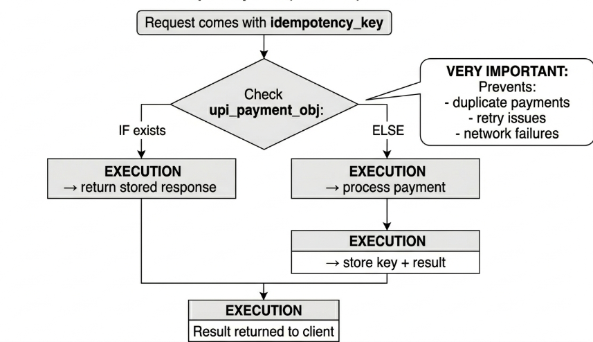

<div align="center">

# 🏦 Double Ledger & Banking System

**Full-stack banking system — double-entry ledger · UPI payments · refresh token rotation · audit logging · notifications · cards · loans · React dashboard**


[](https://aryandevcodes.github.io/Bank-Ledger-Payment-Engine/)
[](http://localhost:8080/swagger-ui.html)

</div>


---

## 📌 Contents

- [What this project is](#-what-this-project-is)
- [Why this system matters](#-why-this-system-matters)
- [Demo](#-demo)
- [Architecture Diagrams](#-architecture-diagrams)
- [Tech Stack](#-tech-stack)
- [Quick Start](#-quick-start)
- [Roles & Access Control](#-roles--access-control)
- [API Reference](#-api-reference)
- [Authentication Module](#1-authentication-module--apiauthbase)
- [Bank Management](#2-bank-management--bank)
- [Customer Management](#3-customer-management--customer)
- [Account Management](#4-account-management--account)
- [Transaction Processing](#5-transaction-processing--transaction)
- [UPI Payment System](#6-upi-payment-system--upi)
- [QR Code Generation](#7-qr-code-generation--qr)
- [Audit Logging](#8-audit-logging--audit)
- [Security & Session Management](#9-security--session-management--security)
- [Notifications](#10-notifications--apinotifications)
- [Debit Cards](#11-debit-cards--apidebit-cards)
- [Debit Card Requests](#12-debit-card-requests--apidebit-card-requests)
- [Credit Cards & Plans](#13-credit-cards--plans--apicredit-cards--apicredit-plans)
- [Loans & EMI](#14-loans--emi--apiloans--apiemis)
- [Account Statements](#15-account-statements--apiaccountsaccountnumberstatement)
- [Webhooks](#16-webhooks--apiwebhooks)
- [Composite & Card Events](#17-composite--card-events--apicomposite--streamevents)
- [Ledger Architecture](#-ledger-architecture-double-entry)
- [Security Design](#-security-design)
- [Database Schema](#-database-schema)
- [Frontend](#-frontend-react-dashboard)
- [Troubleshooting](#-troubleshooting)
- [Extra Docs](#-extra-docs)
- [License](#-license)

---

## ✨ What this project is

A production-grade **Spring Boot 3.5.10** banking backend paired with a **React + Vite** dashboard.  
It models money movement using an **immutable double-entry ledger**, provides **idempotent UPI payments**, and wraps everything in a full **JWT-based auth system** with audit trails, session tracking, and role-based access for five distinct user roles.

The security centrepiece is **full sender ownership validation**: even if someone knows an account number or UPI ID, they *cannot* initiate payments unless the authenticated JWT user truly owns the sender account.

---

## Why this system matters

Storing balances directly can produce inconsistencies under concurrent updates, retries, and partial failures.  
This system avoids that by:

- Deriving balances exclusively from ledger entries (DEBIT / CREDIT)
- Enforcing double-entry accounting on every money movement
- Maintaining append-only ledger records for complete auditability
- Persisting idempotency state before execution to prevent duplicate debits

---

## 🎬 Demo

- ▶️ **Live Demo:** https://aryandevcodes.github.io/Bank-Ledger-Payment-Engine/
- 📄 **Local demo HTML:** [demo/index.html](demo/index.html)

[](https://www.youtube.com/watch?v=qOHr7ZWKY7E)

---

## 🗺️ Architecture Diagrams

> Diagram assets live in [demo/docs/](demo/docs).

### System Architecture

```
Client (Browser / Postman)
        │
        ▼
  JWT Auth Filter  ←──  Spring Security (stateless)
        │
        ▼
  REST Controllers  (20 controllers, 125+ endpoints)
        │
        ▼
  Service Layer  (business logic, ownership checks)
        │
   ┌────┴────────────────────┐
   ▼                         ▼
Ledger Writer           UPI Resolver
(double-entry)         (ownership validation)
   │                         │
   └────────────┬────────────┘
                ▼
        PostgreSQL (ACID)
  ┌─────────────────────────────┐
  │ accounts · transactions     │
  │ ledger (append-only)        │
  │ upi_profiles · upi_payment  │
  │ audit_logs · access_logs    │
  │ user_sessions · refresh_tokens │
  │ notifications · cards · loans  │
  └─────────────────────────────┘
```



### Database Relations (ERD)

```
Bank ──1:N──> Account ──M:1──> Customer ──M:1──> User
                │
                ├──1:N──> Transaction ──1:N──> Ledger
                │
                └──1:N──> UpiProfile ──1:N──> UpiPaymentOBJ
                                                    │
                                              Transaction (ref)
```



### Ledger Engine (double-entry)

Every money movement creates exactly two ledger records:

| Step | Entry | Account | Amount |
|------|-------|---------|--------|
| 1 | DEBIT | Sender | +X |
| 2 | CREDIT | Receiver | +X |

Balance = `SUM(CREDIT) - SUM(DEBIT)` from the ledger — never from a stored column.



### Complete Payment Flow

```
Client → POST /upi/pay
  ↓
Validate input (amount > 0, fromUpi ≠ toUpi)
  ↓
Idempotency check (upi_payment_obj)
  ├─ COMPLETED  →  return stored result (no double-debit)
  ├─ FAILED     →  throw exception with stored failure reason
  └─ INITIATED  →  persist PROCESSING state (iron-clad lock)
                      ↓
               Ownership validation (UpiResolver)
                      ↓
               Double-entry ledger write
                      ↓
               Update status → COMPLETED / FAILED
                      ↓
               Return TransactionResponseDTO
```



### Idempotency Flow



---

## 🧰 Tech Stack

### Backend
| Technology | Version | Purpose |
|---|---|---|
| Java | 21 | Language |
| Spring Boot | 3.5.10 | Framework |
| Spring Security 6 | bundled | Auth & method security |
| Spring Data JPA | bundled | ORM / repository layer |
| Hibernate | 6.6.x | JPA provider |
| PostgreSQL | 15+ | Primary database |
| JJWT | 0.12.6 | JWT generation & validation |
| MapStruct | 1.6.3 | Type-safe DTO mapping |
| SpringDoc OpenAPI | 2.7.0 | Swagger UI |
| Spring Actuator | bundled | Health and metrics endpoints |
| Spring Mail | bundled | Password reset email delivery |
| Spring Cache + Redis | bundled | Optional caching layer |
| OpenPDF | 1.3.30 | PDF statement export |
| ZXing | 3.5.3 | QR code generation |
| Lombok | bundled | Boilerplate reduction |
| Jakarta Validation | bundled | Request validation |

### Frontend
| Technology | Purpose |
|---|---|
| React 18 + TypeScript | UI framework |
| Vite | Dev server & bundler |
| Tailwind CSS | Utility-first styling |
| shadcn/ui + Radix UI | Component library |
| Recharts | Charts & graphs |
| React Router v6 | Client-side routing |
| Lucide React | Icon set |

---

## 🚀 Quick Start

### Prerequisites

- Java 21
- PostgreSQL 15+ running locally
- Node.js 18+

### 1 — Configure the backend

Edit `src/main/resources/application.yml` with your PostgreSQL credentials.

### 2 — Start Spring Boot (port 8080)

```powershell
# Windows
.\mvnw.cmd spring-boot:run
```

```bash
# macOS / Linux
./mvnw spring-boot:run
```

### 3 — Start the React frontend

```bash
cd bank-frontend
npm install
```

Create `bank-frontend/.env.local`:

```env
VITE_API_BASE_URL=http://localhost:8080
VITE_ENABLE_AUDIT=true
VITE_ENABLE_SECURITY=true
```

> Set `VITE_ENABLE_AUDIT` / `VITE_ENABLE_SECURITY` to `false` if those backend modules are disabled.

```bash
npm run dev
```

Frontend: `http://localhost:8081` (or `http://localhost:5173`)

### 4 — Swagger UI

- `http://localhost:8080/swagger-ui.html`
- `http://localhost:8080/v3/api-docs`

---

## 🔔 Recent Changes (2026-08-04)

- Backend:
  - Hardened production configuration and JPA transactional boundaries to avoid LazyInitialization issues in production.
  - Enforced KYC checks: transactions now require KYC-verified sender and receiver; card request flows accept ACTIVE KYC states where appropriate.
  - Adjusted controller authorization for card and credit-plan endpoints to align manager/admin roles.
  - Added unit tests for KYC, authorization, and transaction rules (ran `./mvnw test`).

- Frontend:
  - Added a new public `HomePage` at `/` with an operational overview and primary actions.
  - Centralized API error parsing in `src/lib/api-client.ts` (`getApiErrorMessage`, `getResponseErrorMessage`) so backend messages surface consistently in toasts.
  - Replaced many ad-hoc error toasts across pages/hooks to use the shared error helpers.
  - Built a production bundle and validated preview locally (`npm run build` then `npm run preview`).

If you need the exact file/line changes or want me to open a PR with these commits, tell me and I'll push a branch and create the PR.

---

## 👥 Roles & Access Control

The system implements five roles enforced via `@PreAuthorize` on every endpoint:

| Role | Description |
|------|-------------|
| `ROLE_ADMIN` | Full access — all endpoints including delete, sessions, actuator |
| `ROLE_MANAGER` | Bank, customer, account, transaction, UPI management |
| `ROLE_CUSTOMER_MANAGER` | Customer and account read/update; compliance updates |
| `ROLE_AUDITOR` | Read-only access to all financial data + audit logs |
| `ROLE_USER` | Own accounts, own transactions, UPI payments only |

**Public endpoints** (no token required):
- `POST /api/auth/login`
- `POST /api/auth/forgot-password`
- `POST /api/auth/reset-password`
- `POST /api/auth/refresh`
- `GET /swagger-ui/**`
- `GET /v3/api-docs/**`

---

## 📚 API Reference

### 1. Authentication Module — `/api/auth` (base)

| Method | Endpoint | Auth | Description |
|--------|----------|------|-------------|
| `POST` | `/api/auth/login` | Public | Authenticate and receive JWT access + refresh tokens. Sets `passwordChangeRequired` flag on first login. |
| `POST` | `/api/auth/forgot-password` | Public | Request a password reset token (15-minute TTL). Response is generic; token delivered via email. |
| `POST` | `/api/auth/reset-password` | Public | Consume reset token and set a new password (min 8 chars). Clears token on success. |
| `GET` | `/api/auth/me` | Any authenticated | Returns enriched user profile: roles, KYC status, account count, total balance, UPI count, transaction count, and compliance counters (role-aware). |
| `POST` | `/api/auth/change-password` | Any authenticated | Change password with current password verification. Bypassed on first login. |
| `POST` | `/api/auth/refresh` | Public | Rotate refresh token and return new access + refresh tokens. |
| `POST` | `/api/auth/logout` | Any authenticated | Records logout event in `access_logs` and terminates the active session record. |

**`POST /api/auth/login` response fields:**
```json
{
  "accessToken": "eyJ...",
  "refreshToken": "eyJ...",
  "tokenType": "Bearer",
  "userId": 1,
  "username": "admin",
  "email": "admin@bank.com",
  "fullName": "Admin User",
  "roles": ["ROLE_ADMIN"],
  "expiresAt": "2026-05-11T19:38:00",
  "passwordChangeRequired": false
}
```

**`GET /api/auth/me` enriched response** (fields vary by role):
```json
{
  "id": 1, "username": "alice", "email": "alice@bank.com",
  "primaryRole": "ROLE_USER",
  "customerId": "SBI_abc123", "kycStatus": "ACTIVE", "customerStatus": "ACTIVE",
  "accountCount": 2, "totalBalance": 45000.00, "upiProfileCount": 1,
  "transactionCount": 12,
  "managedBankCount": 3,        // ADMIN/MANAGER/AUDITOR only
  "pendingKycCount": 5,         // ADMIN/MANAGER/CUSTOMER_MANAGER only
  "auditSuccessCount": 340,     // ADMIN/AUDITOR only
  "failedLoginCount": 2         // ADMIN only
}
```

---

### 2. Bank Management — `/bank`

| Method | Endpoint | Roles | Description |
|--------|----------|-------|-------------|
| `GET` | `/bank` | ADMIN, MANAGER, AUDITOR | List all banks |
| `GET` | `/bank/{id}` | ADMIN, MANAGER, AUDITOR | Get bank by ID |
| `GET` | `/bank/upi/{upiId}` | ADMIN, MANAGER, AUDITOR, USER | Find bank by UPI ID |
| `POST` | `/bank/create` | ADMIN only | Create bank (auto-generates ID: `BANKNAME_xxxxx`) |
| `PATCH` | `/bank/{id}` | ADMIN only | Update bank details |
| `DELETE` | `/bank/{id}` | ADMIN only | Delete bank |

**Bank fields:** `bankName`, `branch`, `ifscCode` (unique), `city`, `state`, `branchAddress`

---

### 3. Customer Management — `/customer`

| Method | Endpoint | Roles | Description |
|--------|----------|-------|-------------|
| `GET` | `/customer` | ADMIN, MANAGER, CUSTOMER_MANAGER, AUDITOR | List all customers |
| `GET` | `/customer/paginated` | ADMIN, MANAGER, CUSTOMER_MANAGER, AUDITOR | Paginated customer list |
| `GET` | `/customer/me` | All authenticated | Get own customer profile (by JWT user ID) |
| `GET` | `/customer/email/{email}` | ADMIN, MANAGER, CUSTOMER_MANAGER, AUDITOR | Get customer by email |
| `GET` | `/customer/search?name=&bankName=` | ADMIN, MANAGER, CUSTOMER_MANAGER | Search by name and bank |
| `GET` | `/customer/bank?bankName=` | ADMIN, MANAGER, CUSTOMER_MANAGER | List customers by bank |
| `PATCH` | `/customer/update?name=&email=&phoneNumber=` | ADMIN, CUSTOMER_MANAGER | Update customer details |
| `DELETE` | `/customer/delete?id=` | ADMIN only | Delete customer |

**Customer fields:** `fullName`, `email` (unique), `phoneNumber` (unique), `address`, `age`, `kycStatus`, `customerStatus`

---

### 4. Account Management — `/account`

| Method | Endpoint | Roles | Description |
|--------|----------|-------|-------------|
| `GET` | `/account` | ADMIN, MANAGER, CUSTOMER_MANAGER, AUDITOR | List all accounts |
| `GET` | `/account/paginated` | ADMIN, MANAGER, CUSTOMER_MANAGER, AUDITOR | Paginated account list |
| `GET` | `/account/my` | All authenticated | Get own accounts (by JWT user ID) |
| `GET` | `/account/{id}` | ADMIN, MANAGER, CUSTOMER_MANAGER, AUDITOR | Get account by ID |
| `GET` | `/account/name/{bankName}` | ADMIN, MANAGER, CUSTOMER_MANAGER, AUDITOR | List accounts by bank |
| `GET` | `/account/email/{email}` | ADMIN, MANAGER, CUSTOMER_MANAGER | List accounts by customer email |
| `GET` | `/account/validate-receiver?accountNumber=&bankName=` | ADMIN, MANAGER, USER | Validate receiver account |
| `GET` | `/account/lookup-by-number?accountNumber=` | ADMIN, MANAGER, CUSTOMER_MANAGER, AUDITOR | Lookup account by number |
| `GET` | `/account/{accountNumber}/balance` | ADMIN, MANAGER, AUDITOR, USER | Ledger-derived balance |
| `POST` | `/account/{bankName}` | ADMIN, MANAGER | Create account (auto-generates number: `ACC_BANKNAME_xxxxx`) |
| `PATCH` | `/account/{accNumber}` | ADMIN, MANAGER | Update account details |
| `PATCH` | `/account/{accNumber}/compliance` | ADMIN, MANAGER, CUSTOMER_MANAGER | Update `accountStatus`, `kycStatus`, `customerStatus` |
| `DELETE` | `/account/{accNumber}` | ADMIN only | Delete account |

---

### 5. Transaction Processing — `/transaction`

| Method | Endpoint | Roles | Description |
|--------|----------|-------|-------------|
| `GET` | `/transaction/all` | ADMIN, MANAGER, AUDITOR | Get all transactions (no filter) |
| `GET` | `/transaction/all/paginated` | ADMIN, MANAGER, AUDITOR | Paginated transaction list |
| `GET` | `/transaction?accountNumber=&email=` | ADMIN, MANAGER, AUDITOR, USER | Get transactions by account + email |
| `GET` | `/transaction/my` | All authenticated | Get own transactions (by JWT user ID) |
| `GET` | `/transaction/customer/{customerId}` | ADMIN, MANAGER, AUDITOR, CUSTOMER_MANAGER | Get all transactions for a customer |
| `GET` | `/transaction/accounts/{id}/balance` | ADMIN, MANAGER, AUDITOR, USER | Get ledger-derived balance for an account |
| `POST` | `/transaction` | **ROLE_USER only** | Initiate a money transfer (sender ownership enforced) |
| `POST` | `/transaction/{transactionId}/reverse` | ADMIN, MANAGER | Reverse a completed transaction |
| `GET` | `/transaction/{transactionId}/receipt` | ADMIN, MANAGER, AUDITOR, USER | Get transaction receipt details |

**Transaction states:** `INITIATED → PROCESSING → COMPLETED / FAILED`

**Transfer request:**
```json
{
  "senderAccount": "ACC_SBI_xxxxx",
  "receiverAccount": "ACC_HDFC_xxxxx",
  "amount": 5000.00
}
```

---

### 6. UPI Payment System — `/upi`

| Method | Endpoint | Roles | Description |
|--------|----------|-------|-------------|
| `POST` | `/upi/register` | ADMIN, MANAGER, USER | Register a UPI profile linked to an account |
| `GET` | `/upi` | ADMIN, MANAGER, AUDITOR, USER | List all UPI profiles |
| `GET` | `/upi/paginated` | ADMIN, MANAGER, AUDITOR, USER | Paginated UPI profiles |
| `GET` | `/upi/my` | All authenticated | Get own UPI profiles (by JWT user ID) |
| `GET` | `/upi/{upiId}` | ADMIN, MANAGER, AUDITOR, USER | Get UPI profile by UPI ID |
| `GET` | `/upi/account/{accountNumber}` | ADMIN, MANAGER, USER | List UPI profiles for an account |
| `PATCH` | `/upi/{upiId}/status?status=` | ADMIN, MANAGER, USER | Update UPI profile status (ACTIVE/INACTIVE) |
| `PUT` | `/upi/{upiId}/toggle?enabled=` | ADMIN, MANAGER, USER | Toggle UPI profile enablement |
| `DELETE` | `/upi/{upiId}` | **ADMIN only** | Soft-delete UPI profile |
| `POST` | `/upi/pay` | **ROLE_USER only** | Execute idempotent UPI payment |

**Idempotent payment request:**
```json
{
  "fromUpi": "alice@sbi",
  "toUpi": "bob@hdfc",
  "amount": 1000.00,
  "idempotencyKey": "unique-client-key-123"
}
```

**Payment execution states:** `INITIATED → PROCESSING → COMPLETED / FAILED`  
Failure reason stored in `upi_payment_obj.failure_reason` for debugging and audit.

---

### 7. QR Code Generation — `/qr`

| Method | Endpoint | Roles | Description |
|--------|----------|-------|-------------|
| `GET` | `/qr/generate?upiId=&name=&amount=&width=&height=` | ADMIN, MANAGER, USER | Generate UPI payment QR code (PNG). Format: `upi://pay?pa=...&pn=...&am=...&cu=INR` |
| `GET` | `/qr/account?accountNumber=&bankName=&ifscCode=&width=&height=` | ADMIN, MANAGER, USER | Generate account details QR code (PNG) |

Returns `image/png` bytes. Width/height default to 300×300.

---

### 8. Audit Logging — `/audit`

> Access restricted to `ROLE_ADMIN` and `ROLE_AUDITOR`.

| Method | Endpoint | Description |
|--------|----------|-------------|
| `GET` | `/audit/logs` | Paginated audit log query with filters |
| `GET` | `/audit/logs/{id}` | Get single audit log entry by UUID |

**Query parameters for `/audit/logs`:**

| Param | Format | Description |
|-------|--------|-------------|
| `startDate` | `yyyy-MM-dd` or ISO datetime | Filter from date |
| `endDate` | `yyyy-MM-dd` or ISO datetime | Filter to date |
| `action` | `VIEW`, `CREATE`, `UPDATE`, `DELETE` | Filter by action type |
| `userId` | string | Filter by user ID |
| `resource` | string | Filter by resource type (e.g. `TRANSACTION`) |
| `page` | integer (default 1) | Page number |
| `size` | integer (default 25) | Page size |

**Audit log entry fields:** `id` (UUID), `timestamp`, `userId`, `userName`, `action`, `resource`, `resourceId`, `details`, `ipAddress`, `userAgent`, `status` (SUCCESS / FAILED)

**Automatic audit capture** — `AuditLoggingInterceptor` runs after every non-excluded HTTP request and automatically logs `VIEW/CREATE/UPDATE/DELETE` events. Excluded paths: `/audit`, `/security`, `/api/auth`, `/swagger-ui`, `/v3/api-docs`, `/actuator`.

**Explicit audit events** captured in code: `LOGIN`, `LOGOUT`, `PASSWORD_RESET_REQUEST`, `PASSWORD_RESET`, `UPDATE` (password change).

---

### 9. Security & Session Management — `/security`

> All endpoints restricted to `ROLE_ADMIN`.

| Method | Endpoint | Description |
|--------|----------|-------------|
| `GET` | `/security/sessions` | List all active user sessions |
| `DELETE` | `/security/sessions/{sessionId}` | Terminate a specific session by UUID |
| `POST` | `/security/sessions/terminate-all` | Terminate all sessions (optionally exclude caller's own) |
| `GET` | `/security/access-logs?startDate=&endDate=&eventType=` | Query access logs |

**Session fields:** `id`, `tokenId`, `userId`, `userName`, `ipAddress`, `userAgent`, `createdAt`, `lastActivity`, `expiresAt`, `active`

**Access log event types** (`AccessEventType`): `LOGIN_SUCCESS`, `FAILED_LOGIN`, `LOGOUT`, `PASSWORD_CHANGE`

**Access log fields:** `id`, `timestamp`, `userId`, `userName`, `eventType`, `ipAddress`, `userAgent`, `location`, `success`

---

### 10. Notifications — `/api/notifications`

| Method | Endpoint | Description |
|--------|----------|-------------|
| `GET` | `/api/notifications?page=&size=` | Paginated notifications for current user |
| `GET` | `/api/notifications/unread` | List unread notifications |
| `GET` | `/api/notifications/unread/count` | Count unread notifications |
| `PUT` | `/api/notifications/{notificationId}/read` | Mark a notification as read |
| `PUT` | `/api/notifications/read-all` | Mark all notifications as read |

User ID is derived from the bearer token; users can only access their own notifications.

---

### 11. Debit Cards — `/api/debit-cards`

| Method | Endpoint | Roles | Description |
|--------|----------|-------|-------------|
| `GET` | `/api/debit-cards/account/{accountId}` | ADMIN, MANAGER, USER | Get cards by account ID |
| `GET` | `/api/debit-cards/account-number/{accountNumber}` | ADMIN, MANAGER, USER | Get cards by account number |
| `GET` | `/api/debit-cards/{cardId}` | ADMIN, MANAGER, USER | Get card by ID |
| `PUT` | `/api/debit-cards/{cardId}/toggle-contactless?enabled=` | ADMIN, USER | Toggle contactless |
| `PUT` | `/api/debit-cards/{cardId}/toggle-international?enabled=` | ADMIN, USER | Toggle international |
| `PUT` | `/api/debit-cards/{cardId}/toggle-otp?enabled=` | ADMIN, USER | Toggle OTP verification |
| `PUT` | `/api/debit-cards/{cardId}/limits` | ADMIN, USER | Update daily/monthly limits |
| `PUT` | `/api/debit-cards/{cardId}/merchant-blocks` | ADMIN, USER | Update blocked merchant categories |
| `POST` | `/api/debit-cards/{cardId}/freeze?reason=` | ADMIN, USER | Freeze card |
| `POST` | `/api/debit-cards/{cardId}/unfreeze` | ADMIN, USER | Unfreeze card |
| `POST` | `/api/debit-cards/{cardId}/replace` | ADMIN, USER | Request replacement |
| `PUT` | `/api/debit-cards/{cardId}/block?reason=` | ADMIN, USER | Permanently block card |

---

### 12. Debit Card Requests — `/api/debit-card-requests`

| Method | Endpoint | Roles | Description |
|--------|----------|-------|-------------|
| `POST` | `/api/debit-card-requests` | USER | Create a debit card request |
| `GET` | `/api/debit-card-requests/my` | USER | Current user's requests |
| `GET` | `/api/debit-card-requests/pending` | ADMIN, MANAGER | Pending requests |
| `GET` | `/api/debit-card-requests/approved` | ADMIN, MANAGER | Approved requests |
| `GET` | `/api/debit-card-requests/issued` | ADMIN, MANAGER | Issued requests |
| `POST` | `/api/debit-card-requests/{requestId}/approve` | ADMIN, MANAGER | Approve request |
| `POST` | `/api/debit-card-requests/{requestId}/reject` | ADMIN, MANAGER | Reject request |
| `POST` | `/api/debit-card-requests/{requestId}/issue` | ADMIN, MANAGER | Mark as issued |
| `POST` | `/api/debit-card-requests/{requestId}/dispatch` | ADMIN, MANAGER | Mark as dispatched |
| `POST` | `/api/debit-card-requests/{requestId}/deliver` | ADMIN, MANAGER | Mark as delivered |

---

### 13. Credit Cards & Plans — `/api/credit-cards`, `/api/credit-plans`

**Credit Cards**

| Method | Endpoint | Roles | Description |
|--------|----------|-------|-------------|
| `GET` | `/api/credit-cards/account/{accountId}` | ADMIN, MANAGER, USER | Cards for account |
| `GET` | `/api/credit-cards/account-number/{accountNumber}` | ADMIN, MANAGER, USER | Cards for account number |
| `GET` | `/api/credit-cards/{cardId}` | ADMIN, MANAGER, USER | Get card by ID |
| `PUT` | `/api/credit-cards/{cardId}/toggle-contactless?enabled=` | ADMIN, USER | Toggle contactless |
| `PUT` | `/api/credit-cards/{cardId}/toggle-international?enabled=` | ADMIN, USER | Toggle international |
| `PUT` | `/api/credit-cards/{cardId}/toggle-otp?enabled=` | ADMIN, USER | Toggle OTP verification |
| `PUT` | `/api/credit-cards/{cardId}/limits` | ADMIN, USER | Update limits |
| `PUT` | `/api/credit-cards/{cardId}/merchant-blocks` | ADMIN, USER | Update blocked merchant categories |
| `POST` | `/api/credit-cards/{cardId}/freeze` | ADMIN, USER | Freeze card |
| `POST` | `/api/credit-cards/{cardId}/unfreeze` | ADMIN, USER | Unfreeze card |
| `POST` | `/api/credit-cards/{cardId}/replace` | ADMIN, USER | Request replacement |
| `PUT` | `/api/credit-cards/{cardId}/block?reason=` | ADMIN, USER | Permanently block card |

**Credit Plans**

| Method | Endpoint | Roles | Description |
|--------|----------|-------|-------------|
| `GET` | `/api/credit-plans` | ADMIN, MANAGER, USER | List plans |
| `GET` | `/api/credit-plans/all` | ADMIN, MANAGER | List all plans (admin/manager view) |
| `POST` | `/api/credit-plans` | ADMIN, MANAGER | Create plan |
| `PATCH` | `/api/credit-plans/{planId}` | ADMIN, MANAGER | Update plan |
| `POST` | `/api/credit-plans/{planId}/assign/{cardId}` | ADMIN, MANAGER | Assign plan to card |

---

### 14. Loans & EMI — `/api/loans`, `/api/emis`

**Loans**

| Method | Endpoint | Roles | Description |
|--------|----------|-------|-------------|
| `GET` | `/api/loans/customer/{customerId}` | ADMIN, MANAGER, USER | Loans for customer |
| `GET` | `/api/loans/account/{accountId}` | ADMIN, MANAGER, USER | Loans for account |
| `GET` | `/api/loans/{loanId}` | ADMIN, MANAGER, USER | Loan by ID |
| `POST` | `/api/loans` | ADMIN, MANAGER | Create loan |

**EMI**

| Method | Endpoint | Roles | Description |
|--------|----------|-------|-------------|
| `GET` | `/api/emis/loan/{loanId}` | ADMIN, MANAGER, USER | EMI schedule for loan |
| `GET` | `/api/emis/{emiId}` | ADMIN, MANAGER, USER | EMI details by ID |

---

### 15. Account Statements — `/api/accounts/{accountNumber}/statement`

| Method | Endpoint | Auth | Description |
|--------|----------|------|-------------|
| `GET` | `/api/accounts/{accountNumber}/statement?format=csv&from=&to=` | Any authenticated | Export statement as CSV or PDF |

---

### 16. Webhooks — `/api/webhooks`

| Method | Endpoint | Roles | Description |
|--------|----------|-------|-------------|
| `POST` | `/api/webhooks` | ADMIN, MANAGER | Register new webhook subscription |
| `GET` | `/api/webhooks` | ADMIN, MANAGER, AUDITOR | List all subscriptions |
| `DELETE` | `/api/webhooks/{id}` | ADMIN, MANAGER | Delete subscription |
| `PATCH` | `/api/webhooks/{id}/active?active=` | ADMIN, MANAGER | Enable or disable subscription |

---

### 17. Composite & Card Events — `/api/composite`, `/stream/events`

**Composite**

| Method | Endpoint | Description |
|--------|----------|-------------|
| `GET` | `/api/composite/my/overview` | Aggregated dashboard overview |
| `POST` | `/api/composite/transfer` | Composite transfer workflow |
| `GET` | `/api/composite/customers/{customerId}/banking-profile` | Customer banking profile |
| `GET` | `/api/composite/banks/{bankId}/operations-summary` | Bank operations summary |
| `POST` | `/api/composite/accounts/balance-check` | Multi-account balance check |
| `GET` | `/api/composite/transactions/advanced` | Advanced transaction search |
| `GET` | `/api/composite/search/global` | Global search across entities |
| `POST` | `/api/composite/accounts/{accountNumber}/freeze` | Freeze account |
| `POST` | `/api/composite/customers/{customerId}/kyc-verify` | KYC verification action |

**Card Events (SSE)**

- `GET /stream/events` — Server-sent events stream; access token provided via query param `token`.

---

## 🧾 Ledger Architecture (double-entry)

Every transaction creates **exactly two** immutable ledger entries:

```
Transaction: Alice → Bob  ₹5,000

Ledger entries:
  account_id=Alice  DEBIT   ₹5,000  reference_id=TXN_001
  account_id=Bob    CREDIT  ₹5,000  reference_id=TXN_001
```

**Balance derivation:**
```sql
SELECT COALESCE(SUM(
  CASE
    WHEN entry_type = 'CREDIT' THEN amount
    WHEN entry_type = 'DEBIT'  THEN -amount
  END
), 0) FROM ledger WHERE account_id = :accountId;
```

**Unique constraint** `uk_ledger_entry (reference_id, account_id, entry_type)` prevents duplicate entries.

---

## 🛡️ Security Design

### JWT Authentication
- Stateless JWT (Spring Security 6 + JJWT 0.12.6)
- Every protected request must include `Authorization: Bearer <token>`
- Token TTL: 24 hours; refresh token also issued at login
- Refresh tokens are hashed in `refresh_tokens`; rotation revokes reuse and the token family
- `@EnableMethodSecurity(prePostEnabled = true)` — fine-grained `@PreAuthorize` on every endpoint

### Sender Ownership Enforcement (IDOR prevention)
- `POST /transaction` — `TransactionServiceIMPL` verifies the authenticated principal owns the sender account
- `POST /upi/pay` — `UpiResolver.resolveAndVerifyOwnership()` checks `JWT username → Customer → User.username` chain
- Throws HTTP 403 on mismatch

### Password Security
- BCrypt password hashing
- First-login flow: password change required flag set, skips current-password check
- Forgot-password: cryptographically random 32-byte token (Base64Url encoded), 15-minute TTL
- Reset token cleared from DB on use or expiry

### CORS
Allowed origins (configurable): `http://localhost:8081`, `http://localhost:5173`, `http://localhost:3000`

### Concurrency Safety
- Pessimistic write lock (`PESSIMISTIC_WRITE`) on accounts during transactions
- Deterministic lock ordering (ascending account ID) to prevent deadlocks
- `@Transactional` boundaries ensure atomic ledger + status updates

---

## 🗄️ Database Schema

### Tables (22+)

| Table | Description |
|-------|-------------|
| `users` | Auth users with roles, avatar URL, reset token fields |
| `roles` | Five roles: ADMIN, MANAGER, CUSTOMER_MANAGER, AUDITOR, USER |
| `user_roles` | Join table for user-role many-to-many |
| `banks` | Bank master data |
| `customers` | Customer profiles linked to users |
| `accounts` | Bank accounts linked to customers and banks |
| `transactions` | Transaction records with denormalised snapshot fields |
| `ledger` | Append-only double-entry financial ledger |
| `upi_profiles` | UPI ID registrations linked to accounts |
| `upi_payment_obj` | UPI payment intents with idempotency key + failure reason |
| `audit_logs` | Auto-captured API activity log |
| `access_logs` | Security access events (login, logout, password change) |
| `user_sessions` | Active JWT session tracking |
| `refresh_tokens` | Hashed refresh token records with rotation metadata |
| `notifications` | Per-user notification records |
| `debit_cards` | Debit cards with limits and controls |
| `debit_card_requests` | Physical debit card requests |
| `credit_cards` | Credit cards linked to accounts and plans |
| `credit_plans` | Credit plan definitions |
| `loans` | Loan records |
| `emis` | EMI schedule rows |
| `webhook_subscriptions` | Outbound webhook registrations |

### Key Indexes

```sql
idx_ledger_account_id          -- ledger(account_id)
idx_ledger_reference_id        -- ledger(reference_id)
idx_upi_payment_key            -- upi_payment_obj(idempotency_key)
idx_upi_payment_status         -- upi_payment_obj(status)
idx_transactions_date          -- transactions(transaction_date DESC)
idx_audit_logs_timestamp       -- audit_logs(timestamp)
idx_audit_logs_action          -- audit_logs(action)
idx_audit_logs_user_id         -- audit_logs(user_id)
idx_audit_logs_resource        -- audit_logs(resource)
idx_access_logs_timestamp      -- access_logs(timestamp)
idx_access_logs_event_type     -- access_logs(event_type)
idx_access_logs_user_id        -- access_logs(user_id)
idx_user_sessions_token_id     -- user_sessions(token_id) UNIQUE
idx_user_sessions_active       -- user_sessions(is_active)
idx_user_sessions_user_id      -- user_sessions(user_id)
```

---

## 🖥️ Frontend (React Dashboard)

Frontend lives in `bank-frontend/` (React 18 + TypeScript + Vite).

### Pages

| Route | Component | Access |
|-------|-----------|--------|
| `/` | `Index.tsx` | Redirect to login/dashboard |
| `/login` | `LoginPage.tsx` | Public |
| `/register` | `RegisterPage.tsx` | Public |
| `/forgot-password` | `ForgotPasswordPage.tsx` | Public |
| `/set-password` | `SetPasswordPage.tsx` | Public (token flow) |
| `/dashboard` | `Dashboard.tsx` | All authenticated |
| `/banks` | `BanksPage.tsx` | ADMIN, MANAGER, AUDITOR |
| `/customers` | `CustomersPage.tsx` | ADMIN, MANAGER, CUSTOMER_MANAGER, AUDITOR |
| `/accounts` | `AccountsPage.tsx` | ADMIN, MANAGER, CUSTOMER_MANAGER, AUDITOR, USER |
| `/transactions` | `TransactionsPage.tsx` | All authenticated |
| `/payments` | `PaymentsPage.tsx` | All authenticated |
| `/upi` | `UpiPage.tsx` | All authenticated |
| `/audit-logs` | `AuditLogsPage.tsx` | ADMIN, AUDITOR |
| `/security` | `SecurityPage.tsx` | ADMIN |
| `/profile` | `ProfilePage.tsx` | All authenticated |

### Key Frontend Features

- **Role-based routing** — `ProtectedRoute` + `PermissionGate` components gate pages and UI sections by role
- **Role-based dashboards** — separate views for Admin, Manager, Customer Manager, Auditor, User
- **Global Command Palette** (`Ctrl+K`) — `GlobalCommandPalette.tsx` for quick navigation
- **Dashboard charts** — area chart (transaction volume trend), pie chart (status distribution), bar chart (bank distribution) via Recharts
- **`/api/auth/me` enriched profile** — single request drives the entire profile page (identity, banking metrics, compliance counters)
- **QR code viewer** — `QRCodeGenerator.tsx` renders UPI and account QR codes inline
- **Password flow** — forgot-password and set-password pages with token-based reset
- **Audit log table** — filterable, paginated log viewer
- **Security screen** — session list with terminate controls + access log viewer
- **Feature flags** — `VITE_ENABLE_AUDIT` and `VITE_ENABLE_SECURITY` toggle audit/security modules without code changes
- **Theme toggle** — light/dark mode via `ThemeProvider`
- **Responsive sidebar** — collapsible `AppSidebar` with role-filtered navigation items
- **Compliance card** — `ComplianceCard.tsx` shows KYC and compliance summary

### Frontend Scripts

```bash
cd bank-frontend
npm run dev       # dev server (localhost:5173)
npm run build     # production build
npm run preview   # preview production build
npm run test      # run tests
```

---

## 🧯 Troubleshooting

- **Frontend shows empty data** → confirm backend is running and `VITE_API_BASE_URL` is set correctly
- **Port conflicts** → frontend defaults to `:5173` (Vite) or `:8081`; backend uses `:8080`
- **Database connection fails** → verify PostgreSQL is up and `application.yml` credentials are correct
- **JWT 401 errors** → token expired (24h TTL) — log in again
- **Idempotency key conflicts** → use a fresh unique key per new payment attempt
- **Deadlocks (should not occur)** → deterministic account locking is implemented; check that `lockAccountsInOrder()` is not bypassed

---

## 📎 Extra Docs

- Full project report: [PROJECT_REPORT.md](PROJECT_REPORT.md)
- Swagger spec (YAML): [swagger-documentation/openapi.yaml](swagger-documentation/openapi.yaml)
- Swagger spec (JSON): [swagger-documentation/openapi.json](swagger-documentation/openapi.json)

---

## 📄 License

[MIT](LICENSE)
